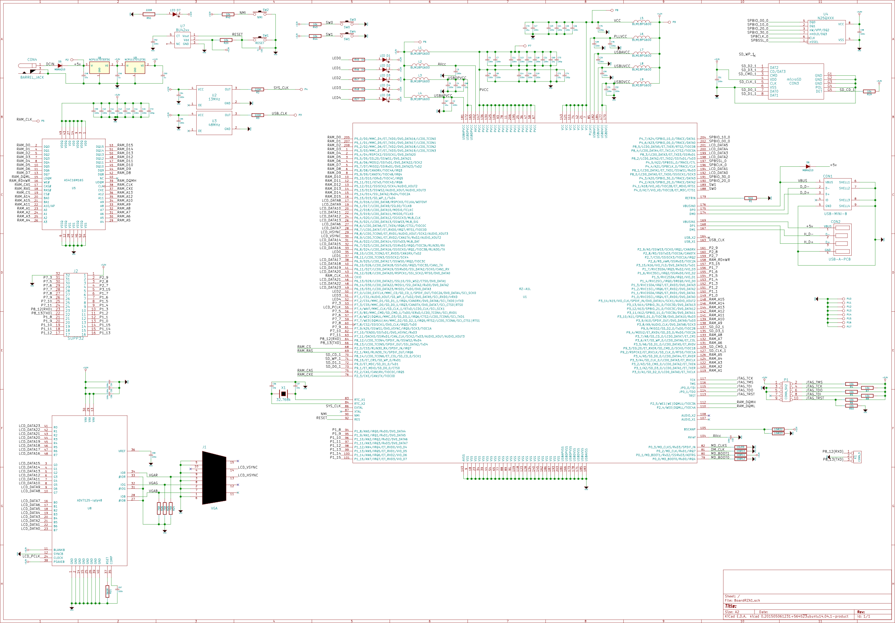

RZ/A1L Board
============

Cortex-A9 board for Renesas RZ CPU using KiCAD

Hardware
--------

 - **CPU**: RZ/A1L 208LQFP
 - **RAM**: 32/64M sdram
 - **Flash**: 16/32M QSPI FLASH
 - **VGA**: 24bpp@<TBD>Hz
 - **USB**: 1 Host & 1 Dev
 - **GPIO**: 30 GPIO (+6 LED +2 Button) Muxed with:

Block Diagram
-------------

Schematic
---------

Preview
-------

Top view

Bottom view

