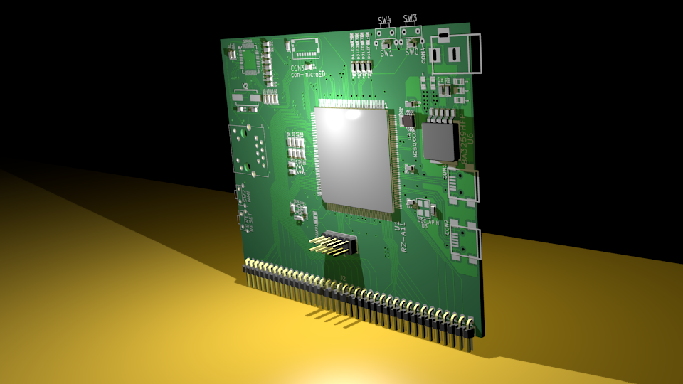

RZ/A1L Board
============

Cortex-A9 board for Renesas RZ CPU using KiCAD

Hardware
--------

 - **CPU**: RZ/A1L 208LQFP
 - **RAM**: 32/64M sdram
 - **Flash**: 16/32M QSPI FLASH
 - **Ethernet**: TBD
 - **LCD**: TBD
 - **USB**: Host/Dev X2
 - **GPIO**: TBD

Preview
-------

Top view

Bottom view

