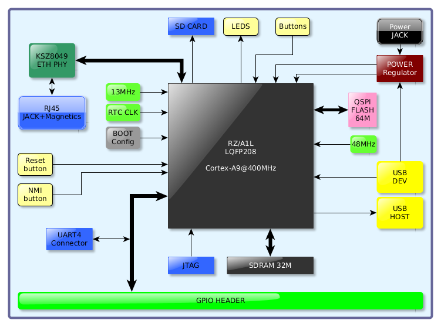
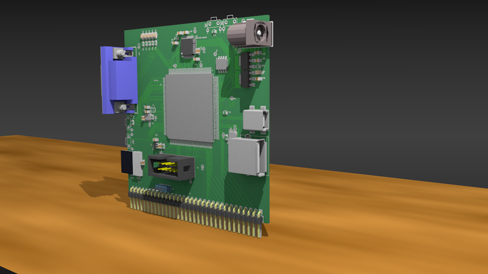
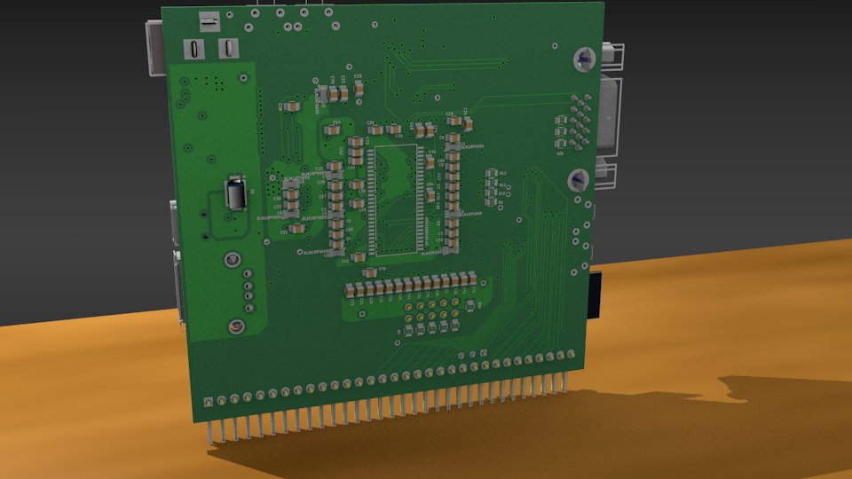

RZ/A1L Board
============

Cortex-A9 board for Renesas RZ CPU using KiCAD

Hardware
--------

 - **CPU**: RZ/A1L 208LQFP
 - **RAM**: 32/64M sdram
 - **Flash**: 16/32M QSPI FLASH
 - **Ethernet**: 10/100M
 - **USB**: 1 Host & 1 Dev
 - **GPIO**: 36 GPIO (+4 LED +2 Button) Muxed with:
     - **4 i2c**
     - **2 SPI**
     - **2 UART**
     - **2 CAN**
     - **1 LIN**
     - **8 ADC Channels**
     - **8 IRQ inputs**
     - **1 Serial Sound Interface (SSI)**

Block Diagram
-------------

Preview
-------

Top view

Bottom view

